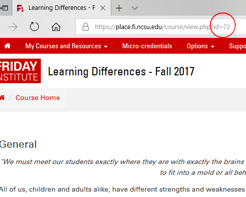

```{r setup, include = FALSE}
knitr::opts_chunk$set(
  collapse = TRUE,
  comment = "#>"
)
```


# Introduction
This guide provides a detailed, task-oriented walkthrough of how to retrieve Friday Institute Moodle data with the `fimoodler` package.  It steps through a variety of critical decisions researchers have to make when analyzing data from Massive Open Online Courses (MOOCs) and describes how to use the package to implement those decisions.

## Package Overview
The `fimoodler` package has the functions you need to fetch, manipulate, and format data from the Friday Institute Moodle database for the purpose of analyzing courses.  There are functions to pull information about enrollments, activity logs (i.e. trace data), and plugin specific information (e.g. questionnaires, surveys, and certificates) from the database.

This package is developed with the following principles in mind:
* Friday Institute focus.  The Moodle instance run by the Friday Institute has different components than other Moodle instances.  The Friday Institute also uses (or doesn't use) some features in the same ways that other providers do.  The Friday Institute uses Moodle primarily for offering MOOCs and micro-credentials.
* Course analysis focus.  The functions provided by this package aid the analysis of Moodle courses.  This package is not a comprehensive Moodle database querying tool, nor does it 
* Course-specific orientation.  Function calls are centered around data for one course.  This makes the code a lot easier to manage, even when working with multiple courses.  It also reminds the programmer to think about course differences that should be considered, even when the courses are iterations of one another.
* Parameter guidance.  Function parameters are used to guide the programmer through decision making steps.  This may cause functionality to not be as neatly compartmentalized as it could be.
* Minimal Moodle database knowledge required.  There's no question that the more you know about the way Moodle works on the back-end, the less likely you are to make a mistake when you build your data set.  However, this package makes life a little easier by only requiring familiarity with key data tables.  Contextual complexities and joining of multiple tables is handled behind the scenes.
* Readability over performance.  Due to the shorthanded development staff and use of graduate research assistants, this package may change authorship.  Code must be well documented, readable, and use well-known packages where possible.  Loosely follows tidyverse grammars and style guide.
* Database independent.  Uses dbplyr to support translation of queries into a variety of database languages.
* Anonymous data.  Uses anonymous identifiers for users.  Names and emails are not returned by functions in this package.

It's worthwhile to take some time to get familiar with the Moodle database before using this package. The more you know about the way Moodle works on the back-end, the less likely you are to make a mistake when you interpret the data.

This package is a living product.  It will be updated as more is learned about Moodle, Moodle is updated, and Friday Institute processes change.  Thus, it is important to save a copy of the package version you are using, so your results are more likely to be reproducible (see the `packrat` package for help on doing this).

If you are hoping to use this package with a Moodle installation at another organization, expect to make some modifications to the source code.  A strong majority of the source code will translate to other Moodle installations, but some of the code accommodates for specific ways the Friday Institute utilizes Moodle features.

## Setup

### Database Access
Talk to your database administrator.  At the Friday Institute, this is Mark Samberg.  Note that read-only access is given to Friday Institute researchers.  This means temporary tables cannot be used in queries.

### Preparing Your Development Environment
1. Download and use RStudio if you aren't already using it.
2. Install the `fimoodler` package.  Also consider installing the `dplyr` and `lubridate` packages, which are part of the `tidyverse`, and will help you work with the data, once you have pulled it from the database.
```{r eval=FALSE, indent = "    "}
# The development version is the only version available
# install.packages("devtools")
devtools::install_github("TheFridayInstitute/fimoodler", build_vignettes = TRUE)
```
3. Create a new RStudio project.  Each time you do an analysis for a paper/poster/presentation/etc., you should create a new RStudio project (or clone a previous project and edit the clone).  This will maintain a copy of your code, so you can always reproduce your analyses.  Projects should be used, instead of individual code files, so you can take advantage of Packrat and other RStudio tools that allow you to reproduce your development environment.
4. Setup Packrat for your new project.  Packrat allows you to save a copy of the specific version of each package you are using in a project.  That way, if a package is ever changed or discontinued, you can still run your code the way it was originally run.
5. Create a local data bin.  To ensure your data analyses are repeatable, consider saving local copies of the fetched data you end up using in your analyses.  Small details can change in the database at any time.  For example, an instructor could move an activity module from one unit to another.  If you fetched data before and after, you would see different amounts of resource use in the two units.

# Using the fimoodler Package
The `fimoodler` package has the functions you need to fetch, manipulate, and format data from the Moodle database.  This section introduces you to the package with functions organized by task, so it's easier to pick-up and use.  The most common use cases are discussed and examples are provided.  If you want to explore the package further, consult the package documentation.  You can see all the details of a function by using the `?` command.

## Loading the Package
Before you use any functions in the `fimoodler` package, you'll want to attach the package with the `library` function.  Here, you would also attach any other packages you want to use, such as `dplyr` and `lubridate`.

Before you access a Moodle database, you also need to create a connection to the database.  The easiest way to do this is to start a session (see code below).  Once a session is started, the `fimoodler` package will use the session details by default in all future database queries, unless manually overridden.  You only need to start one session.  You can keep using it until the database kicks you off (e.g. if you are inactive for too long).  When you are done, be sure to close the session with `end_db_session`.  Also, before starting the new session, always make sure you closed your previous session.

```{r eval=FALSE}
library(fimoodler)

# You will be prompted for password
start_db_session(
  host = "localhost",
  port = 3306,
  dbname = "moodle",
  username = "moodle-ro"
)

# Close the session when you're done for the day
end_db_session()
```

## Selecting Courses
Every course is different, even iterations of the same course differ.   These differences can impact research measures, so knowing the course context and selecting the right courses is very important.  Consult the [Course Meta-data reference](#ref_course_meta-data), course instructor, course facilitators, and Moodle admin (Mark Samberg).  Also, look through the course yourself.  Consider topic area, the number of resources included, the types of resources used, the purposes those resources serve, the degree of facilitation, the number of units, the length of the course, whether micro-credentials are offered, whether or not there was an orientation, certificate requirements, number of certificates offered, among many other potential differences.  Also consider that design-based research and experiments have been performed in many classes.  Ultimately, you need to be an expert in the courses you analyze.

Many functions in the `fimoodler` package have been intentionally designed to only work on one course at a time.  This encourages the researcher to consider decision points for each course individually.  This should always be the case.

You will need the database's courseid number for each course you want to analyze.  Most `fimoodler` functions use the courseid to know what data to fetch.  You can get the courseid in two ways.  One is to examine a list of all courses in the database using `list_courses()`.  Another is to navigate to the course home page in your web browser and look at the URL.  The value of the id parameter in the URL is the courseid.



## Selecting Users {#selecting_users}
Users are the foundation of your analyses.  Your selection of users will determine the enrollment numbers you report, what activity logs get counted, completion percentages, dropout percentages, and much more.

A series of decisions must be made when selecting users, and the questions below will get you started.  There is NO SUCH THING as "I don't need to specify all of that."  Anyone who wants to do any kind of analysis needs to carefully and thoughtfully consider all of the decision points discussed below. 

Each decision point should be documented in your personal records and in probably in any publication.  This will help you explain your enrollment numbers if any other researchers publish a different number of users in the same course.

**Between which dates do you want to look at enrollments?**

Some researchers want to subset the user population based on time.  Maybe your analysis focuses on people that registered before the course.  Maybe your analysis focuses on people who registered after the course started.

Even if you think time isn't an issue, you should still specify it where you can.  Typically, course registration opens month(s) before a course begins at The Friday Institute.  If you don't have access to the date it opened, you can leave the earliest date you consider enrollments unspecified.  You should have access to the date a course ends, however.  For reproducibility, any analysis that will be published should at least specify a cutoff date for the last day of enrollments considered.  That way, if any participants register later (for any unexpected reason), the user count is still likely to be consistent.  The cutoff could be the end of the course or the date the data is pulled.

```{r eval=FALSE}
# Enrolled during course
enrolled <- fetch_enrolled_users(
  course_id = 72,
  after = lubridate::ymd("2017-10-02", tz = "US/Eastern"),
  before = lubridate::ymd("2017-12-16", tz = "US/Eastern")
)
```

**On which methods of enrollment do you want to focus?**

On the surface, enrollment method may seem unimportant.  However, due to the procedures used at The Friday Institute, considering enrollment method can help you exclude unwanted users.  In some courses, affiliates (e.g. funding agency representatives) are enrolled manually by an administrator, so they can preview the course.  These users aren't always given a *preview* role, as they should, so excluding manual enrollments can help filter them out.  Typically, these users would be excluded, because they aren't representative of the general user population.

A risk of filtering out manual enrollments is you lose some potentially relevant users.  There are people (albeit few in number) who experience difficulties with the website and can't enroll in a course, even with help from support.  In some cases, these people are enrolled manually by an administrator.  Though again, these people may not be representative of the general population.

Another reason to consider enrollment method is to eliminate missing survey data.  If you focus only on survey enrollments, you essentially perform list-wise deletion on users that didn't fill out the survey.

```{r eval=FALSE}
# Enrolled via enrollment survey
enrolled <- fetch_enrolled_users(
  course_id = 72,
  method = c("survey")
)
```

**Are unenrolled users important?** 

"Unenrolled users" are users who unenrolled from a course, usually by request.  Typically, unenrolled users are ignored in the analyses corresponding to the course from which they unenrolled, because (a) Moodle only retains partial information about unenrolled users, (b) only a few people request it each course, and (c) requesting unenrollment inherently makes an individual a non-standard participant.  

The `fimoodler` package currently supports fetching a list of unenrolled users, but the package does not currently support fetching other types of data for unenrolled users, such as group membership.  Unenrolled user logstore events and enrollment survey responses are preserved in the database.  However, information in other tables is lost, such as to which groups the users were assigned.  The only way to recover information would be to trace the logs and see what can be recovered.

Unenrolled user enrollments are identified by a combination of the presence of a logstore enrollment event and the absence of a record in the enrollments database table.

```{r eval=FALSE}
# Enrolled and then unenrolled
unenrolled <- fetch_unenrolled_users(course_id = 72)
```

**On which roles do you want to focus?**

Different people enter Moodle courses for different reasons.  Students generally enter to learn.  Instructors generally enter to edit and facilitate the course.  System administrators generally enter to make sure there are no technical problems.  Researchers generally enter to explore.  Ignoring these role-based differences could lead to drastic bias in analyses.  Instructors and facilitators typically use a course more than any student, so including their data would bias conclusions about students.  In all research cases, user roles should be selected carefully.

You can use `list_roles()` to see the list of potential roles, and you can use `fetch_course_roles` to identify users roles in a course.

Note that users can have more than one role.  For example, most instructors, facilitators, and researchers will have a "student" role for the course they work on, which allows them to see a course from the student perspective.  Typically, we want to exclude these people from analyses and focus on pure student users.  Friday Institute procedure says administrators, instructors, facilitators, and researchers should be identifiable by an "internal" role, which is in addition to a "student" role.  Thus, you can get pure students by selecting users with only one role, that is a "student" role.  This method is not guaranteed to be perfect because it depends on (a) people notifying an administrator that they need to be labeled as an "internal" user and (b) the labeling actually getting done correctly.  However, it's the best method we have.  If you notice something that suggests an internal user has not been assigned an internal role, please tell Mark Samberg.

```{r eval=FALSE}
# Identify pure students
user_ids <- c(6900, 701, 733, 749)
pure_students <- dplyr::tibble(userid = user_ids) %>%
  dplyr::bind_cols(fetch_course_roles(course_id = 72, user_ids = user_ids)) %>%
  dplyr::filter(rolenames == "student")
```

** Are you interested in a particular demographic? **

At the Friday Institute, the Moodle user profile is used to store demographic data.  User profile data is recorded when a user account is created.  This data exists at the person-level and is independent of the courses to which a user enrolls.

User profile data consists of standard *details* (e.g. country, timezone, etc.) pre-programmed into Moodle and custom *info* questions added to your Moodle installation.  Details and info have different data structures, so separate `fimoodler` functions are used to get the data:  `fetch_user_details` and `fetch_user_info` respectively.  At the Friday Institute, custom info questions collect gender, organization affilliation, years of experience in education, and other professional attributes.  All custom info is recorded in strings, so you will have to type the data yourself.

```{r eval=FALSE}
# Highest degree is a Master's
user_ids <- c(701, 733, 749)
masters <- dplyr::tibble("userid" = user_ids) %>%
  dplyr::bind_cols(fetch_user_info(user_ids)) %>%
  dplyr::filter(educationlevel == "Masters Degree")
```

** Are you interested in people who enter a course with specific goals or prior knowledge? **

During the standard course enrollment process, users are asked a variety of questions related to the course.  These questions vary between courses (even iterations of the same course), but they often address users' goals for the course and what prior knowledge they have that's relevant to the course.  This information can be crucial to analyses.  For example, an analysis of course completion rate would be very misleading if it did not account for the fact that a small subset of users intend to complete courses.  Enrollment survey responses could help you select only users who intend to complete.

The *enrollment survey* tool used to collect this information is a custom Moodle component used by the Friday Institute (see [GitHub page](https://github.com/TheFridayInstitute/moodle_enrol_survey)).  It has its own data structure and its own functions in `fimoodler`.  You can see a list of enrollment surveys in a course - along with their questions and response choices - by executing `list_enroll_surveys`.  Most often there is only one survey for a course, but there can be multiple, e.g. if different groups get different surveys.  To get responses to a survey, you need to execute `fetch_enroll_survey` and specify which survey to fetch.  (Get the esurveyid from `list_enroll_surveys`.)

```{r eval=FALSE}
# Enrollment survey data
survey_responses <- fetch_enroll_survey(
  esurvey_id = 280,
  user_ids = c(701, 733, 749)
)
```

** Do you need to focus on (or exclude) members of a course group? **

Users are often put into groups to create separate forum cohorts or experimental conditions.  Depending on how groups are used in your course, you may want to analyze the groups differently.  You can view a list of groups in a course with `list_groups`, and you can get a list of groups to which users belong with `fetch_groups`.

```{r eval=FALSE}
# Belong to G02 experimental condition
user_ids <- c(701, 733, 749)
grp_02 <- dplyr::tibble("userid" = user_ids) %>%
  dplyr::bind_cols(fetch_groups(course_id = 72, user_ids = user_ids)) %>%
  dplyr::filter(groupname_G02)
```

**Are you interested in people who don't ever enter the course?  What about people who look at the home page but never use a resource?  What about people who are just visiting/exploring/sampling/shopping?**

A large percentage of people who enroll never access or use a resource.  In many cases, these "no-shows" would be considered a distinct from the general user population and would be excluded from analyses.  Similarly, people who check out the course but don't engage in substantial learning may not be of interest to an analysis.  Theses "shoppers" or "visitors" could be excluded by a variety of activity log criteria, such as using the course less than a few days and accessing only a handful of resources.

Use `fetch_logs()` to get activity data and calculate your inclusion/exclusion criteria.  See [Selecting Activity Data](#selecting_log_data) section for details.  Note that you will have to either fetch a second activity data set for your analyses after excluding users, or you can initially pull the entire logstore for the course and locally filter it as needed.

```{r eval=FALSE}
# Entered the course at least once during the course (i.e. any log event present)
logs <- fetch_logs(
  course_id = 72,
  user_ids = c(701, 733, 749),
  after = lubridate::ymd("2017-10-02", tz = "US/Eastern"),
  before = lubridate::ymd("2017-12-16", tz = "US/Eastern")
)
entered <- logs %>%
  dplyr::select(courseid, userid) %>%
  dplyr::distinct() %>%
  dplyr::mutate(entered = TRUE)

# Performed at least one of these actions at least once during the course
resource_events <- c(
  "\\mod_page\\event\\course_module_viewed",
  "\\mod_lesson\\event\\content_page_viewed",
  "\\mod_videoresource\\event\\course_module_viewed",
  "\\mod_quiz\\event\\attempt_submitted",
  "\\mod_assign\\event\\assessable_submitted",
  "\\mod_forum\\event\\discussion_created",
  "\\mod_forum\\event\\discussion_viewed",
  "\\mod_forum\\event\\post_created",
  "\\mod_resourcelib\\event\\resource_viewed",
  "\\mod_url\\event\\course_module_viewed"
)
logs <- fetch_logs(
  course_id = 72,
  user_ids = c(701, 733, 749),
  events = resource_events,
  after = lubridate::ymd("2017-10-02", tz = "US/Eastern"),
  before = lubridate::ymd("2017-12-16", tz = "US/Eastern")
)
used <- logs %>%
  dplyr::select(courseid, userid) %>%
  dplyr::distinct() %>%
  dplyr::mutate(used = TRUE)

```

## Selecting Log Data {#selecting_log_data}

Log data is perhaps the most versatile and reliable of all Moodle data sources.  It provides a history of the actions users perform in Moodle, so it can be used to trace engagement over time.  It records a variety of resource interactions, including some  granular ones (e.g. pressing play/pause on a video), so it allows a fair degree of control over interaction interpretation.  It even records a variety of administrative interactions, such as enrolling in courses, so it can be used to resolve discrepancies in other database tables that only track current status (see unenrolled users section above).

Needless to say, log data is lengthy and complicated, because it tracks so many things.  It is imperative that you carefully consider the questions below, so you don't accidentally omit important information or draw improper conclusions about the data.  

**In whose logs are you interested?**

In some cases, it's helpful to get a quick, coarse overview of a course by displaying a summary of activity for all users.  However, this can be very misleading in research.  For example, leaving instructor and facilitator logs in the data set would bias conclusions about learners.  Undesirable noise from shoppers could also bias conclusions about users who intended to engage in learning.

Typically, a subset of users will be selected.  A common example is pure students who showed up to the course.  Another common example is users who responded to a survey.  See the [Selecting Users](#selecting_users) section above for instructions on how to select users, and then pass them into the `user_ids` parameter.

```{r eval=FALSE}
logs <- fetch_logs(
  course_id = 72,
  user_ids = c(16122, 15302, 15153, 15796, 15831, 15698)
)
```

**What types of resources are you interested in tracking?  And what types of interactions with those resources are you interested in tracking?**

Each entry in the log data has an *event*, which describes an action a user performed in Moodle.  Each event describes with what a user was interacting and how the user was interacting with it.  Some events are administrative, such as editing one's profile or enrolling in a course, and others are learning-oriented, such as watching a video or posting to a forum.

In some cases, it's helpful to get a quick, coarse overview of a course by displaying a summary of all event activity.  However, this can be very misleading in research.  For example, including events for administrative actions, such as changing profile settings, would bias conclusions about learning or engagement.  Further, not considering how resources are used from a pedagogical perspective could bias conclusions about engagement.  In one course a forum could be used solely for technical support, while in another course forums could be used for discussing videos.

The list of possible events must be carefully examined and considered in the context of the course at hand.  Then, each event of interest must be explicitly stated.  It may also be beneficial to categorize similar actions, such as a "posting" category for posting a forum discussion thread and posting a forum discussion reply.  Again, these categories should be considered in the context of the course, depending on how the instructor implemented the resources.  This will take some time to think through, but typically, the selected set is a fairly small subset of the potential events.

You can see a list of events currently in the logs by running `list_events()`.  Some notes have been documented about the events present at the time this was written.  You can see them, along with an example of how the events might be categorized, in this [spreadsheet of events](https://drive.google.com/file/d/0B0P6r0sclAksd3dGYzFxVmtNU2c/view?usp=sharing)

```{r eval=FALSE}
# Focus on key resource interactions 
my_events <- dplyr::tribble(
  ~eventname, ~eventcat,
  "\\mod_page\\event\\course_module_viewed", "lecture note view",
  "\\mod_lesson\\event\\content_page_viewed", "lecture note view",
  "\\mod_videoresource\\event\\course_module_viewed", "video view",
  "\\mod_quiz\\event\\attempt_submitted", "assessment submission",
  "\\mod_assign\\event\\assessable_submitted", "assessment submission",
  "\\mod_forum\\event\\discussion_viewed", "forum view",
  "\\mod_forum\\event\\discussion_created", "forum post",
  "\\mod_forum\\event\\post_created", "forum post",
  "\\mod_resourcelib\\event\\resource_viewed", "external view",
  "\\mod_url\\event\\course_module_viewed", "external view"
)
logs <- fetch_logs(
  course_id = 72,
  user_ids = c(16122, 15302, 15153, 15796, 15831, 15698),
  events = my_events$eventname
)
cat_logs <- logs %>%
  dplyr::left_join(my_events, by = "eventname")
```

**Between which dates do you want to look at logs?**

In virtually every analysis, a researcher would want to subset logs based on when they occurred.  The most common case is focusing on interactions during the course, excluding activity before content was released and after the certificate deadline.  Some other time-related questions to consider:  Do you want to include an "orientation period" that happened before content was released?  Do you want to compare activity in the time frame when content is released to activity in the time frame after content has been released but before the certificate deadline?  Are you interested in how often participants come back to a course after it ends?

Even though Friday Institue courses are generally set to read-only or closed after the courses end, there are exceptions which warrant careful consideration of the time frame you specify.  For example, participants in the evaluation study of Learning Differences Fall 2017 committed to complete the course in exchange for compensation, but most failed to do so in time.  The course was re-opened after it ended to give them extra time to complete.

```{r eval=FALSE}
# Logs occurring during the course
logs <- fetch_logs(
  course_id = 72,
  user_ids = c(16122, 15302, 15153, 15796, 15831, 15698),
  after = lubridate::ymd("2017-10-02", tz = "US/Eastern"),
  before = lubridate::ymd("2017-12-16", tz = "US/Eastern")
)
```
  
**What sections, or units, of the course do you want to analyze?**

Most course resources are grouped in course sections, sometimes colloquially called units.  These groupings may be meaningful to include or exclude.  For example, some instructors use section zero for an "Introduce Yourself" forum and administrative materials, such as course outlines, FAQs, and certificate requirements.  Removing section zero could be an easy way to eliminate events not associated with course content.  If you ignored the sections, measures of learning could be biased.

The `fetch_logs` function automatically appends a `section` column to the return value, which specifies the section in which each event occurs if the target of the event is in a section.  You can filter the fetched data by the `section` column to exclude data you don't want.  Note that the section values are generated when the code is run and could change if an instructor moves the resource.

**Do you want logs to focus on specific resources (or ignore some resources)?**

Some researchers focus their analyses on a single, specific course resource, such as a single forum.  Some researchers want to exclude  resources, such as the optional coaching module in the Learning Differences courses, to eliminate noise or bias.

To focus on logs of specific resources.  You can use the `cm_ids` argument of the `fetch_logs` function to return only logs for the resources you select.  See the [Selecting Course Module Data section](#selecting_module_data) for instructions on selecting resources.  You will also find that the `fetch_logs` function automatically appends the id and name of each resource, to help you identify them when browsing and analyzing the logs.

```{r eval=FALSE}
# Focus on Coaches' Corner videoresource pages
logs <- fetch_logs(
  course_id = 72,
  user_ids = c(16122, 15302, 15153, 15796, 15831, 15698),
  cm_ids = c(4518, 4549, 4888, 4880, 4576)
)
```

**Are there any micro-credentials in your course?**

Logs related to micro-credentials will need to be retrieved separately from any MOOC-Ed course that uses micro-credentials.  By intentional design, Friday Institute micro-credentials exist independently of MOOC-Ed courses.  To implement this design within Moodle, a separate "course" was created to hold all micro-credentials (courseid 15).  MOOC-Ed courses that have micro-credentials then link to the corresponding page in the micro-credential "course."

Within the micro-credential "course", each micro-credential is implemented as a single quiz resource.  You will need to determine the [course module id](#selecting_module_data) of each micro-credential quiz you want to include in your data.  You can do this by running `list_quizzes(15)` or by navigating to the micro-credential quiz page in your web browser and getting the course module id from the URL (see example in the [Selecting Course Module Data section](#selecting_module_data).

To include micro-credential logs with your course logs, you will need to:

1. Make an assumption that users who enrolled in your course and used micro-credentials during the time your course was open were utilizing the micro-credentials for your course.
2. Pull logs for the micro-credentials you linked to in the micro-credential "course" during the times your MOOC-Ed course was running, filtering for only users of your MOOC-Ed course.
3. If helpful, change the course and section numbers in the micro-credential data to match your course of interest and the sections in your course that linked to the micro-credentials.  Better yet, you could preserve the original data and create new columns `pseudocourseid` and `pseudosection` with course and section numbers best for your analysis.
4. Bind the micro-credential logs to your other logs.

```{r eval=FALSE}
# Fall 2017 Learning Differences (courseid 72) micro-credential logs
mcs <- dplyr::tribble(
  ~cmid, ~pseudosection,  #location of link in LD Fall 2017
  3060, 2,
  3061, 3,
  3062, 4,
  3063, 5
)
mc_logs <- fetch_logs(
  course_id = 15, # 15 is the MC course
  user_ids = c(16122, 15302, 15153, 15796, 15831, 15698),
  after = lubridate::ymd("2017-10-02", tz = "US/Eastern"),
  before = lubridate::ymd("2017-12-16", tz = "US/Eastern"),
  cm_ids = mcs$cmid
)

# If helpful, adjust courseid and sections to your course
mc_logs <- mc_logs %>%
  dplyr::left_join(mcs, by = "cmid") %>%
  dplyr::mutate(
    pseudocourseid = 72,
    mclog = TRUE  # keep track of which logs are from MC course
  )  

# Only bind MC logs to course logs after correcting courseid and section
logs <- logs %>%  # logs variable is defined in code snippit above
  dplyr::bind_rows(mc_logs) %>%
  dplyr::mutate(
    pseudocourseid = ifelse(is.na(pseudocourseid), courseid, pseudocourseid),
    pseudosection = ifelse(is.na(pseudosection), section, pseudosection),
    mclog = ifelse(mclog, TRUE, FALSE)
  )
```

**Are you interested in the amount of time between between when the course started (or any other point in time) and when log events occur?**

Many analyses are longitudinal and need an independent variable that captures time in a meaningful way.  A common metric for when a log event occurs is the week of the course in which it occurs, counting from when the first section of content was released.  You might also look at days since registration opened or seconds since the last log event.  You might even look ahead with days until the certificate deadline.

See the [Time Variables section](#time_variables) for details on computing these.


## Selecting Module Data {#selecting_module_data}
In Moodle courses, each type of resource (e.g. forum, quiz, certificate, etc.) is programmed as a separate *module*.  Each module has a template for information an instructor can insert (e.g. resource name, body text, etc.) and a set of features specific to that module (e.g. adding discussions and replies to a forum).  The data structures for each module differ, so each type of module must be handled separately when using `fimoodler`.

Details on each module are described in the sections below.  However, before you try to pull the data, you need to know how to identify the resource from which to pull data.  Every time an instructor adds a resource to a course, a new *instance* of the corresponding module is created with the information the instructor provides (e.g. resource name), and the instance is linked to the course through a *course module id*.  To access the data of a resource, you need to provide its course module id to `fimoodler`.

There are two primary ways of getting course module ids.  You can use one of the `list_` functions to list all course modules of a specific type in a course (see module-specific sections below), or you can navigate to the resource in your web browser and get the course module id from the URL.


Course modules can be deleted.  This often happens while a course is under construction.  It's bad practice to delete them once a course is launched, but it can happen.  Unfortunately, Moodle erases all records of a deleted course module, except for log events that have already occurred.  The `fimoodler` package does not provide functions for deleted course modules, because virtually all information about them is gone.  However, it is important to remember that the logs of deleted course modules still exist.  If you want to remove logs from deleted course modules from the log data, you have to specify all the course module ids you want to keep in the `fetch_logs` function.

### Certificates
Selecting certificates is an important step in the data selection process.  Courses often have multiple certificates, such as Learning Differences with course completion and coaching module completion certificates, so it's important that you understand what each certificate represents before you use it in analysis.

Similar to quizzes and forums, certificates are added to courses as course modules.  You will be able to identify the certificate you want to analyze by running `list_certs`, `list_cms`, or by navigating to the certificate in your web browser.  Then you can run `fetch_certs` to find out who earned that certificate, when they earned it, who viewed it, and when they viewed it.  Note that in most cases, earning is a pre-requisite to viewing.  However, viewing can occur without earning in some cases, such as a course editor viewing the certificate when building the course or a user who took an earlier iteration of the course and requested to just finish what they missed last time.

A word of caution:  You can reliably determine who earned a certificate, but the criteria for earning a certificate might differ from what was stated in the course description.  Certificates rely on humans to specify the criteria for completion.  If completion logic is accidentally misspecified, such as using an OR operator instead of an AND, then certificates may be awarded to the wrong people.  Another interesting case where criteria can differ at the Friday Institute is when completion logic is intentionally different from requirements stated in the course homepage.  For example, time spent in course is usually not checked and on the honor system (i.e. intentional omission).

```{r eval=FALSE}
# Certificate of course completion in LD Fall 2017
user_ids = c(16122, 15302, 15153, 15796, 15831, 15698)
certs <- dplyr::tibble(userid = user_ids) %>%
  dplyr::bind_cols(fetch_certs(cert_cm_id = 4580, user_ids = user_ids))
```

## Computing Variables

In general, you will have to write your own code to compute your variables.  The `dplyr` package can help you manipulate and summarize data fetched with `fimoodler` to get the variables you need.  

However, the  `fimoodler` package provides some helper functions, which are described in this section.

### Time Variables {#time_variables}

Most Moodle data is associated with a time stamp, such as when enrollment occurs, when an event is logged, and when a certificate is earned.  Many analyses want to frame that timestamp in terms of some other point in time, such as time since a course started, time since another log event occurred, or on what day of the week it is.

Some functions are provided to simplify common time calculations.  They utilize the `lubridate` package.  For common calculations, you should be able to modify the examples without knowing much about `lubridate`.  If you need more complex time variables, you will have to learn how to use the `lubridate` package.

The following code is in the context of logs, but the ideas can be applied to any timestamp.

```{r eval=FALSE}
logs <- fetch_logs(
  course_id = 72,
  user_ids = c(16122, 15302)
)

# Time between start of course and log event
logs <- logs %>%
  dplyr::mutate(
    dayofcourse = count_periods(
      start = lubridate::ymd("2017-10-02", tz = "US/Eastern"),
      end = lubridate::as_datetime(timecreated, tz = "US/Eastern"),
      period = lubridate::days(1),
      from_zero = FALSE
    ),
    weekofcourse = count_periods(
      start = lubridate::ymd("2017-10-02", tz = "US/Eastern"),
      end = lubridate::as_datetime(timecreated, tz = "US/Eastern"),
      period = lubridate::weeks(1),
      from_zero = FALSE
    )
  )

# Time between each user's log events
logs <- logs %>%
  dplyr::group_by(courseid, userid) %>%
  dplyr::arrange(timecreated) %>%
  dplyr::mutate(
    duration = count_periods(
      start = lubridate::as_datetime(timecreated, tz = "US/Eastern"),
      end = lubridate::as_datetime(lead(timecreated), tz = "US/Eastern"),
      period = lubridate::seconds(1),
      from_zero = TRUE
    )
  )

# Time instance labels
logs <- logs %>%
  dplyr::mutate(
    dayofweek = lubridate::wday(
      lubridate::as_datetime(timecreated, tz = "US/Eastern"), 
      label = TRUE
    ),
    month = lubridate::month(
      lubridate::as_datetime(timecreated, tz = "US/Eastern"), 
      label = TRUE
    )
  )
```

## Building a Data Set for Analysis
Ultimately, most researchers want a data set ready for statistical analysis.  For example, a wide-format data frame with one row per user and columns for demographic variables, survey responses, and counts of resources use by week.

You will have to write your own code to manipulate and transform the data fetched with `fimoodler` into your desired format.  Again, the `dplyr` package will help.

# Reference Materials

## Course Meta-data {#ref_course_meta-data}
Implementation notes for each course are recorded in this [Google Sheet](https://docs.google.com/spreadsheets/d/1mcTig7QBdgxxpIedz-ICEEQpT58pncISss4qrW5vQ40/edit).  The sheet includes the planned start and end dates for each course, orientation period details, the content release schedule, and additional notes about major changes between iterations and facilitation.  Note that this information is not perfectly accurate.  For example, Mark Samberg often "soft-launches" courses a few days before they are actually scheduled to open.  Records are not maintained for these kinds of ad-hoc decisions.  This means you can't be 100% sure the information is correct, particularly actual start and end dates, but it's the best information available.

The Google Sheet is maintained by Alex Dreier.  If a course you are interested in is not listed, ask him to add it.


